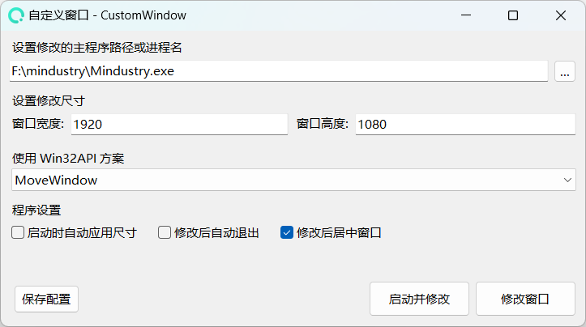

# CustomWindow
一个简单的窗口尺寸修改工具，同时支持静默启动修改，可以代替为启动工具。

## 实现方式

通过调用 Windows API(Win32API) `MoveWindow`、`SetWindowPos` 实现对窗口句柄发送更新窗口位置、尺寸从而更改窗口的状态。

**了解更多API:**
- 全部 [Windows API 索引](https://learn.microsoft.com/zh-cn/windows/win32/apiindex/windows-api-list)
- 了解 [MoveWindow](https://learn.microsoft.com/zh-cn/windows/win32/api/winuser/nf-winuser-movewindow)
- 了解 [SetWindowPos](https://learn.microsoft.com/zh-cn/windows/win32/api/winuser/nf-winuser-setwindowpos)

## 使用方法

> 使用本工具需要先安装 [.NET8](https://dotnet.microsoft.com/zh-cn/download/dotnet/8.0) 桌面运行环境。

**视频教学：**
[点此前往查看视频](https://www.bilibili.com/video/BV1tTqcYmEMp/)

**文字教学：**
1. 运行工具
2. 选择程序路径或程序的进程名称
3. 设置一个尺寸
4. 点击 修改窗口按钮 测试是否修改成功

## 下载软件

1. 通过 [Github Release](https://github.com/FastChen/CustomWindow/releases) 下载
2. 通过 [发布页](https://nullcraft.org/d/100) 下载
3. 通过 [用户群](https://jq.qq.com/?_wv=1027&k=A9YzWvbS) 下载

## 软件图片

